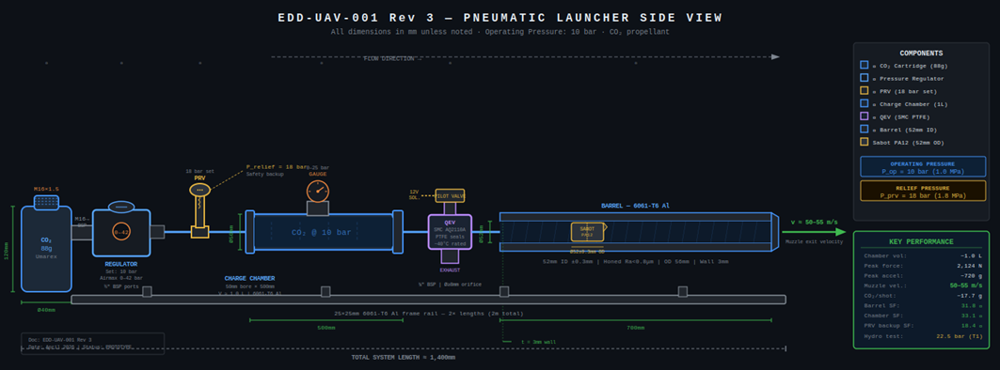
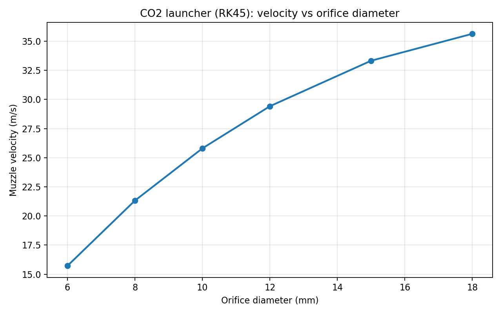
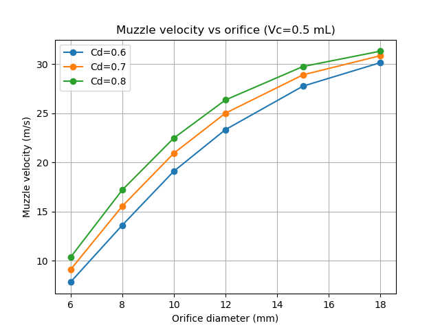
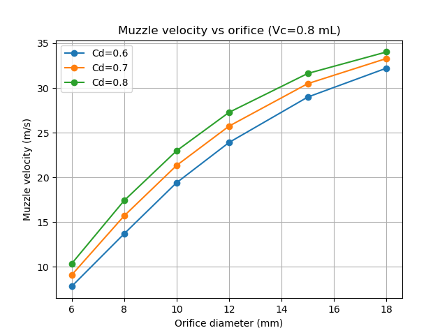
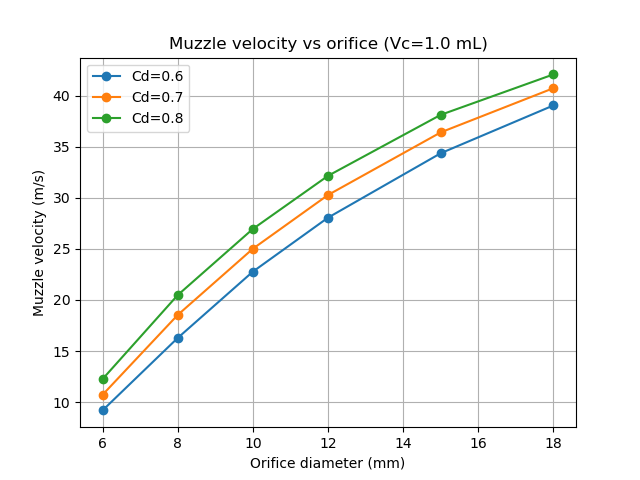
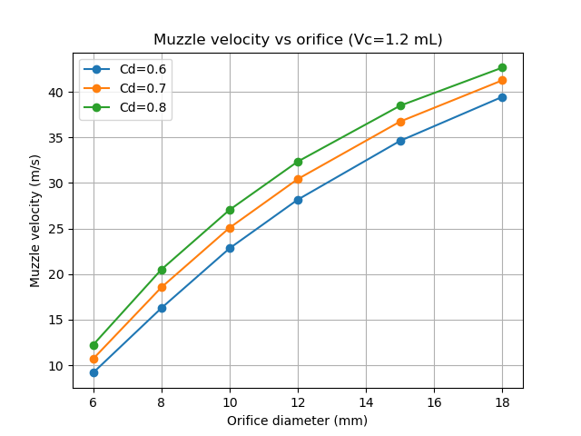
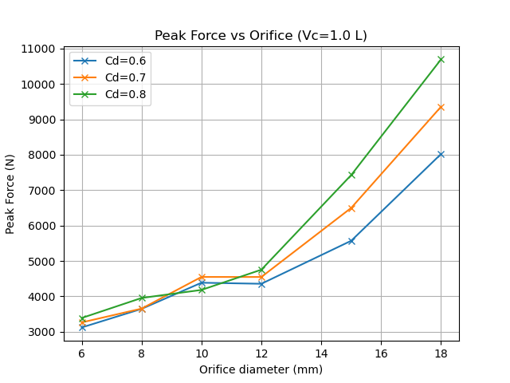
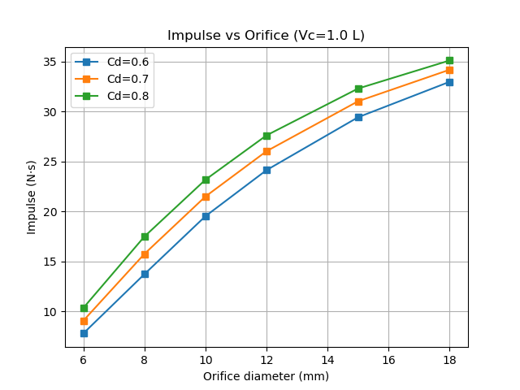
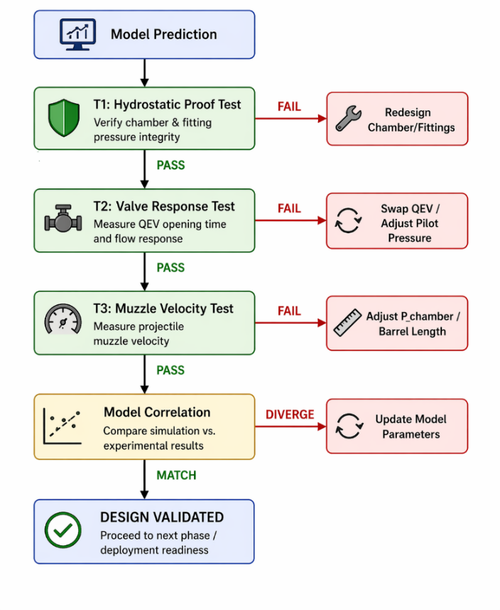

**ENGINEERING DESIGN DOCUMENT**

**CO₂-Based Pneumatic Launcher System**

Autonomous / Semi-Manual Pneumatic Accelerator Platform

# Table of Contents

[Table of Contents](#table-of-contents)

[1. System Overview](#system-overview)

[1.1 Purpose](#purpose)

[1.2 Key Performance Requirements](#key-performance-requirements)

[1.3 Scope Limitations](#scope-limitations)

[1.4 Governing Input Parameters](#governing-input-parameters)

[1.5 Energy and Performance Envelope](#energy-and-performance-envelope)

[2. System Architecture](#system-architecture)

[2.2 Component Interaction](#component-interaction)

[2.3 Signal &amp; Control Flow](#signal-control-flow)

[2.4 Engineering Drawing](#engineering-drawing)

[3. Component-Level Design](#component-level-design)

[3.1 Gas Source](#gas-source)

[CO₂ Cartridge](#co₂-cartridge)

[CO₂ vs Compressed Air Trade-off](#co₂-vs-compressed-air-trade-off)

[3.2 Pressure Regulation](#pressure-regulation)

[3.3 Charge Chamber](#charge-chamber)

[Volume Estimation](#volume-estimation)

[Material and Pressure Rating](#material-and-pressure-rating)

[3.4 Valve System](#valve-system)

[Recommended Configuration: QEV + Pilot Solenoid](#recommended-configuration-qev-pilot-solenoid)

[Cv Role in the Model (IMPORTANT CORRECTION)](#cv-role-in-the-model-important-correction)

[3.5 Trigger System](#trigger-system)

[3.6 Barrel Design](#barrel-design)

[4. Physics &amp; Modeling (Rev 3 — Coupled ODE Model)](#physics-modeling-rev-3-coupled-ode-model)

[4.0 Modeling Assumptions (Explicit)](#modeling-assumptions-explicit)

[4.1 Layer A: Gas Supply Thermodynamics](#layer-a-gas-supply-thermodynamics)

[4.2 Layer B: Valve Mass Flow Model](#layer-b-valve-mass-flow-model)

[Choked Flow Condition](#choked-flow-condition)

[Choked mass flow (sonic throat)](#choked-mass-flow-sonic-throat)

[Subsonic mass flow](#subsonic-mass-flow)

[4.3 Layer C: Projectile Dynamics (Coupled ODE)](#layer-c-projectile-dynamics-coupled-ode)

[ODE System (Correct Primary Model)](#ode-system-correct-primary-model)

[Friction Model](#friction-model)

[4.4 Parametric Results (ODE Numerical Sweeps)](#parametric-results-ode-numerical-sweeps)

[Nominal ODE Design Point](#nominal-ode-design-point)

[RK45 Verification Snapshot](#rk45-verification-snapshot)

[Representative Sweep Plots](#representative-sweep-plots)

[4.5 Model Limitations](#model-limitations)

[5. Simulation Approach](#simulation-approach)

[5.1 MATLAB / Simulink (Recommended First Step)](#matlab-simulink-recommended-first-step)

[5.2 CFD — ANSYS Fluent / OpenFOAM (Advanced Only)](#cfd-ansys-fluent-openfoam-advanced-only)

[5.3 Why Simulation Alone is Insufficient](#why-simulation-alone-is-insufficient)

[6. Testing &amp; Validation](#testing-validation)

[6.1 Test Infrastructure](#test-infrastructure)

[6.2 Test Procedures](#test-procedures)

[T1: Pressure Containment Test (Hydrostatic)](#t1-pressure-containment-test-hydrostatic)

[T2: Valve Response Time Test](#t2-valve-response-time-test)

[T3: Muzzle Velocity Test](#t3-muzzle-velocity-test)

[7. Safety Considerations](#safety-considerations)

[7.1 Pressure Containment](#pressure-containment)

[7.2 Valve Failure Modes](#valve-failure-modes)

[7.3 CO₂ Thermal Effects](#co₂-thermal-effects)

[7.4 Structural Integrity](#structural-integrity)

[7.5 Endcap and Fastener Check](#endcap-and-fastener-check)

[8. Bill of Materials (BOM) — Revised](#bill-of-materials-bom-revised)

[8.1 Launcher System BOM](#launcher-system-bom)

[8.2 Interceptor UAV Payload BOM (Appendix B)](#interceptor-uav-payload-bom-appendix-b)

[9. Design Trade-offs](#design-trade-offs)

[9.1 Barrel-Payload Compatibility](#barrel-payload-compatibility)

[9.2 Cost vs Performance](#cost-vs-performance)

[9.3 CO₂ vs Compressed Air](#co₂-vs-compressed-air)

[9.4 Manual vs Autonomous Triggering](#manual-vs-autonomous-triggering)

[10. Conclusion](#conclusion)

[10.1 Optimal Configuration Summary](#optimal-configuration-summary)

[10.2 Priority Design Risks](#priority-design-risks)

[10.3 Requirement Traceability Snapshot](#requirement-traceability-snapshot)

[10.4 Next Steps](#next-steps)

[10.5 Formula Quick Reference](#formula-quick-reference)

[11. References](#_Toc228192151)

[11.1 Technical Standards](#_Toc228192152)

[11.2 Pneumatic Components](#_Toc228192153)

[11.3 Engineering &amp; Physics References](#_Toc228192154)

[11.4 Simulation Resources](#_Toc228192155)

[Appendix A — Revision History](#_Toc228192156)

[Appendix B — Interceptor UAV Payload Design Review](#appendix-a-interceptor-uav-payload-design-review)

[B.1 Proposed 3-inch Foldable Quadcopter](#a.1-proposed-3-inch-foldable-quadcopter)

[B.2 Proposed Specification Summary](#a.2-proposed-specification-summary)

[B.3 Technical Assessment — Correct Choices](#a.3-technical-assessment-correct-choices)

[B.4 Technical Assessment — Issues and Corrections](#a.4-technical-assessment-issues-and-corrections)

[B.5 Interceptor UAV BOM](#a.5-interceptor-uav-bom)

[Appendix C — Technical Justification &amp; Performance Analysis](#appendix-c-technical-justification-performance-analysis)

[C.1 Executive Summary](#c1-executive-summary)

[C.2 System Architecture](#c2-system-architecture)

[C.3 Thermodynamic Analysis](#c3-thermodynamic-analysis)

[C.4 Ballistic Performance Analysis](#c4-ballistic-performance-analysis)

[C.5 Structural Safety Analysis](#c5-structural-safety-analysis)

[C.6 Material Compatibility — CO₂ Cold Duty](#c6-material-compatibility-co2-cold-duty)

[C.7 Why This Design Will Work](#c7-why-this-design-will-work)

[C.8 Required Actions Before First Fire](#c8-required-actions-before-first-fire)

# 1. System Overview

This document defines the engineering design for a CO₂-based pneumatic launcher intended to accelerate a ~1 kg payload to 15–25 m/s using stored compressed CO₂ gas released through a high-flow valve-barrel assembly. The system is designed for field-portable, rapid-recharge operation.

## 1.1 Purpose

- Provide rapid, repeatable launch of a ~1 kg payload.
- Operate autonomously (solenoid trigger) or semi-manually (mechanical trigger).
- Deploy in field environments without external power infrastructure.

## 1.2 Key Performance Requirements

| **Parameter**    | **Value**     | **Notes**           |
| ---------------------- | ------------------- | ------------------------- |
| Launch velocity        | 15–25 m/s          | At barrel exit            |
| Payload mass           | ~1 kg               | With sabot                |
| Operational pressure   | 50–60 bar (source) | Regulated to 8–15 bar WP |
| System mass (launcher) | \< 5 kg             | Field portable            |
| Actuation type         | Manual + solenoid   | Dual-mode                 |
| Cost target            | \< USD 300          | Prototype unit            |
| Recharge time          | \< 30 s             | Cartridge swap            |

## 1.3 Scope Limitations

- This document covers the launcher only — not the interceptor UAV payload design (see Appendix B).
- Flight trajectory, terminal guidance, and payload integration are out of scope.
- Structural mounting hardware design is indicative only.

## 1.4 Governing Input Parameters

The design and validation work in this EDD uses the following governing launcher inputs.

| Parameter                   |     Symbol     |                           Value | Notes                              |
| --------------------------- | :-------------: | ------------------------------: | ---------------------------------- |
| Charge chamber volume       |    $V_{0}$    |              1.0 L (0.0010 m³) | Accumulator tank design point      |
| Working pressure (gauge)    | $P_{0,gauge}$ |                        10.0 bar | Nominal regulated pressure         |
| Working pressure (absolute) |    $P_{0}$    |                       11.00 bar | Used for gas and load calculations |
| Atmospheric pressure        |   $P_{atm}$   |                        1.00 bar | Back-pressure reference            |
| Barrel internal diameter    |      $D$      |                           52 mm | Drawing-derived bore               |
| Barrel length               |      $L$      |                          700 mm | Nominal barrel length              |
| Bore area                   |  $A_{bore}$  |                    0.002124 m² | From 52 mm ID                      |
| CO₂ specific gas constant  |  $R_{spec}$  | 188.92 J kg$^{-1}$ K$^{-1}$ | $R_{u}/M_{CO_2}$                 |
| Temperature                 |      $T$      |                        293.15 K | Ambient charge temperature         |
| Specific heat ratio         |   $\gamma$   |                            1.30 | CO₂ compressible-flow value       |
| Discharge coefficient       |    $C_{d}$    |                     0.8 default | Swept in the study                 |
| Default orifice diameter    |   $d_{or}$   |                           12 mm | Legacy nominal case                |

## 1.5 Energy and Performance Envelope

The ideal isothermal expansion work available from the 1.0 L chamber charged to 10 bar gauge is:

$$
W=P_{0}\cdot V_{0}\cdot\ln\left(\frac{P_{0}}{P_{atm}}\right)=2637.7\;\mathrm{J}
$$

This is an upper bound only. Real launch performance is lower because of valve flow restriction, finite barrel length, friction, and real-gas behavior.

For the legacy nominal ODE case at 12 mm effective orifice and $C_{d}=0.8$:

- Muzzle velocity: **27.765 m/s**
- Muzzle energy: **385.45 J**
- Launch efficiency: **14.61%**

For the requirement-compliant RK45 model, the recommended design band remains **8-10 mm** effective orifice, corresponding to approximately **21.3-25.8 m/s** at 10 bar gauge.

# 2. System Architecture

The launcher consists of six functional subsystems arranged in a linear pneumatic train:

> ```math
> \mathbf{Gas\ Source\  \rightarrow \ Regulator\  \rightarrow \ Charge\ Chamber\  \rightarrow \ Pilot\ Valve\  \rightarrow \ Quick\ Exhaust\ Valve\ (QEV)\  \rightarrow \ Barrel}
> ```

## 2.2 Component Interaction

The CO₂ cartridge supplies high-pressure gas (50–60 bar) which passes through a pressure regulator set to 8–15 bar working pressure. This charges a sealed accumulator chamber of 0.5–1.0 L. The pilot valve (solenoid or mechanical trigger) releases a small control signal that actuates the Quick Exhaust Valve. The QEV dumps chamber pressure directly into the barrel, accelerating the payload down the bore.

## 2.3 Signal & Control Flow

| **Stage** | **Action**                           | **Component** |
| --------------- | ------------------------------------------ | ------------------- |
| 1 — Pre-fire   | Chamber charged to set pressure            | Regulator + Chamber |
| 2 — Command    | Trigger signal sent (manual or electrical) | Pilot valve         |
| 3 — Actuation  | Pilot pressure opens QEV main poppet       | QEV                 |
| 4 — Discharge  | High-flow gas released into barrel         | Barrel              |
| 5 — Launch     | Payload exits barrel at 15–25 m/s         | —                  |
| 6 — Reset      | CO₂ cartridge recharges chamber           | Regulator           |

## 2.4 Engineering Drawing

The current launcher arrangement used by this EDD is shown below.



# 3. Component-Level Design

## 3.1 Gas Source

### CO₂ Cartridge

- Standard 12 g or 88 g CO₂ cylinders (paintball/SodaStream format).
- Storage pressure: 50–60 bar at 20°C (saturated liquid/vapour phase).
- Energy density is high relative to cost — ideal for intermittent use.
- 88 g cylinder provides ~45 L of gas at atmospheric pressure; sufficient for multiple launches.

### CO₂ vs Compressed Air Trade-off

| **Criterion** | **CO₂ Cartridge**               | **Compressed Air Tank** |
| ------------------- | -------------------------------------- | ----------------------------- |
| Working pressure    | 50–60 bar (fixed)                     | Adjustable, 10–300 bar       |
| Cost                | Low (~USD 1–3/cartridge)              | Moderate (~USD 50–150 tank)  |
| Recharge method     | Swap cartridge (\< 30 s)               | Pump/compressor required      |
| Thermal effects     | Gas cools on expansion (Joule-Thomson) | Minimal                       |
| Field portability   | Excellent                              | Moderate — tank bulk         |
| Recommendation      | ✔ Preferred for prototype             | Preferred for sustained ops   |

> CO₂ expansion causes significant barrel cooling (~−10°C to −20°C at orifice). Valve seats must tolerate this. PTFE or Buna-N seals rated to −60°C are required; standard O-rings at sub-zero temperatures will fail.

#### Verification: **Cartridge Size Justification**

Each shot consumes all gas in the charge chamber (QEV dumps it to atmosphere). The CO₂ mass required to fill the 1.0 L chamber to 10 bar gauge (11 bar absolute) at 20 °C is:

```math
m = \frac{P_{abs} \cdot V}{R_{spec} \cdot T} = \frac{(11 \times 10^{5}) \times 0.001}{188.92 \times 293.15} = \frac{1100}{55,397} \approx 19.9\text{ g}
```

where $R_{spec}=\frac{R_u}{M_{CO_2}}=\frac{8.314}{0.04401}=188.92\,\mathrm{J\,kg^{-1}\,K^{-1}}$ for CO₂.

Real-gas correction (Z ≈ 0.97 at Tr = 0.964, Pr = 0.149 from Redlich-Kwong EOS): actual mass ≈ **20.48 g**. Ideal-gas mass (19.86 g) is lower by about **3.1%**, which is acceptable for first-pass cartridge sizing.

| Cartridge | CO₂ mass | Can fill 1.0 L chamber to 10 bar?      | Full shots             |
| --------- | --------- | -------------------------------------- | ---------------------- |
| 12 g      | 12 g      | **No** — 12 g \< 20 g required | 0                      |
| 88 g      | 88 g      | Yes                                    | ~4 (with ~8 g reserve) |

Conclusion is correct: **12 g \< 20 g → insufficient. 88 g → ~4 shots.** The 12 g cartridge cannot produce even one full charge. 88 g cartridges are required. The 12 g size is only viable for chambers ≤ 0.5 L at ≤ 6 bar.

### CO₂ Consumption and Source Sizing

The chamber fill mass for the selected launcher is:

$$
m_{fill}=\frac{P_{abs}V}{R_{spec}T}=\frac{(11\times10^{5})\times0.001}{188.92\times293.15}\approx 0.01986\;\mathrm{kg}=19.86\;\mathrm{g}
$$

Applying the real-gas correction (Z ≈ 0.97) already used elsewhere in this EDD gives an actual full-shot fill mass of approximately **20.48 g CO₂**. Basis: ideal-gas law and Redlich-Kwong EOS as implemented in `scripts/solve_launcher_rk45.py`.

| Cartridge      | CO₂ mass | Can fill 1.0 L chamber to 10 bar gauge? | Full shots |
| -------------- | --------: | --------------------------------------- | ---------: |
| 12 g cartridge |      12 g | No                                      |          0 |
| 88 g cartridge |      88 g | Yes                                     |         ~4 |

> **Note:** Each shot consumes the entire chamber volume (~20 g CO₂ at 10 bar gauge). The pilot-operated QEV opens fully and dumps the whole charge with every firing cycle — partial-fill operation is not possible. Therefore the 12 g cartridge is not usable for this design, and CO₂ consumption is approximately **20 g per shot regardless of target launch velocity**. Achievable velocity is controlled by orifice size, not by how much gas is loaded.

## 3.2 Pressure Regulation

- A two-stage regulator reduces 50–60 bar source to a stable 8–15 bar working pressure.
- Eliminates pressure variability between shots (cartridge depletion effect).
- Recommended: Clippard R32 or Parker R12 series. Set to 10 bar for nominal operations.
- Cracking pressure must be above ambient by at least 2× safety margin.

## 3.3 Charge Chamber

### Volume Estimation

The verified design point from the analysis is a **1.0 L** chamber at **10 bar gauge**. The corresponding ideal isothermal work is **2637.7 J**, and the RK45 sweep shows that this chamber volume supports the target velocity band when paired with an **8-10 mm** effective orifice.

At 10 bar gauge with a 1.0 L chamber, the RK45 sweep predicts:

- **8 mm** orifice: **21.3 m/s**
- **10 mm** orifice: **25.8 m/s**
- **12 mm** orifice: **29.4 m/s**

Accordingly, **1.0 L** remains the recommended chamber size because it provides margin while still supporting the required 15-25 m/s launch envelope with an appropriately sized valve orifice.

### Material and Pressure Rating

| **Property**    | **Specification**                                  |
| --------------------- | -------------------------------------------------------- |
| Material              | 6061-T6 Aluminium or Schedule 80 steel pipe              |
| Working pressure      | 15 bar                                                   |
| Test pressure         | 22.5 bar (1.5× safety factor, per ASME B31.3)           |
| Burst pressure rating | 45+ bar (3× WP minimum)                                 |
| Wall thickness        | 3 mm selected; analytical minimum 0.311 mm at 11 bar abs |
| End caps              | Threaded or welded; no press-fit only                    |

## 3.4 Valve System

The recommended valve system is a **pilot-operated Quick Exhaust Valve (QEV)**. This is the preferred option for the current launcher because it can deliver the required mass flow quickly enough to keep the design within the target launch-velocity band. As throughout this EDD, valve performance should be judged by effective orifice and flow capacity, not by valve name alone.

### Recommended Configuration: QEV + Pilot Solenoid

- QEV (e.g., SMC AQ-series, Parker, or Camozzi) is pilot-operated.
- A small solenoid valve (or manual pushbutton) acts as the pilot, sending a brief pressure pulse to actuate the QEV poppet.
- Recommended effective orifice: **8-10 mm**.
- Cv requirement: **Cv ≥ 1.5** for a 52 mm bore barrel at 10 bar.
- The QEV exhaust port faces the barrel inlet for maximum flow efficiency.

### Response-Time Calculation for the Selected QEV

The total launcher response is approximated by:

$$
t_{total}=t_{QEV}+t_{dwell}
$$

where $t_{QEV}$ is the valve opening response time and $t_{dwell}$ is the projectile transit time in the barrel. Dwell times are taken directly from the RK45 solver (`outputs/rk45_launcher_results.json`). The selected pilot-operated QEV is modelled as a **5 ms nominal** response device with a practical **3–10 ms** range, consistent with QEV manufacturer data and the T2 acceptance threshold of < 10 ms.

| Metric                              |    8 mm orifice |   10 mm orifice |
| ----------------------------------- | --------------: | --------------: |
| Projectile dwell time (RK45)        |        46.63 ms |        40.32 ms |
| Nominal total response (5 ms QEV)   |        51.63 ms |        45.32 ms |
| Total response range (3–10 ms QEV) | 49.63–56.63 ms | 43.32–50.32 ms |

Both recommended orifice cases keep the total trigger-to-exit response below **57 ms**, well within the semi-autonomous deployment window.

### Cv Role in the Model (IMPORTANT CORRECTION)

> Cv defines valve flow capacity only. It does not determine exit velocity directly. The correct causal chain is: Cv → mass flow rate → chamber pressure evolution → force on payload → acceleration → exit velocity. The full chain must be resolved by numerical integration (Section 4). A low Cv valve is flow-limiting; a high Cv valve shifts the bottleneck to chamber volume and barrel length.

## 3.5 Trigger System

| **Parameter** | **Manual Trigger** | **Solenoid Trigger**    |
| ------------------- | ------------------------ | ----------------------------- |
| Latency             | ~150–300 ms (human RT)  | ~5–15 ms (electrical)        |
| Reliability         | High (no electronics)    | Moderate (requires power)     |
| Cost                | \$10–20                 | \$15–30                      |
| Recommended for     | Prototype / semi-auto    | Autonomous / timed deployment |

## 3.6 Barrel Design

- Bore diameter: 52 mm ID with ±0.3 mm tolerance target on finished bore.
- Length: 700 mm nominal. Longer barrel increases dwell time and final velocity, but adds mass and bulk.
- Material: 6061-T6 aluminium tube, 3 mm wall. Analysis gives $t_{\min}=0.311$ mm at 11 bar absolute, so a 3 mm wall provides a large structural margin.
- Barrel length vs velocity trade-off is swept numerically in the ODE model (Section 5.1).
- Payload compatibility is not guaranteed by bore diameter alone: a **40×45 mm** rectangular payload has a **60.21 mm** diagonal envelope, which exceeds the **51.7 mm** minimum bore by **11.5 mm**. A close-fitting sabot is therefore mandatory to prevent tilt-induced jamming.

# 4. Physics & Modeling (Rev 3 — Coupled ODE Model)

This section has been fully rewritten for Rev 3. The previous closed-form velocity equation and purely geometric pressure decay formula have been replaced with a physically consistent three-layer coupled ODE framework. The three layers are:

> Correct causal chain: Gas thermodynamics (Layer A) → Mass flow through valve (Layer B) → Projectile dynamics (Layer C) → Exit velocity
>
> The closed-form formula v = sqrt(2 P A L / m) used in Rev 1/2 is REMOVED as a primary model. It is retained only as a rough order-of-magnitude sanity check, not as a design tool. It omits valve flow constraints, pressure decay during transit, and friction coupling.

## 4.0 Modeling Assumptions (Explicit)

The following assumptions apply to all sub-models in this section:

| **Assumption**                                                               | **Justification / Limitation**                                                       |
| ---------------------------------------------------------------------------------- | ------------------------------------------------------------------------------------------ |
| 1D flow only (lumped model)                                                        | Valid for barrel L/D ≥ 5; neglects radial pressure gradients                              |
| Uniform pressure in chamber at each timestep                                       | Valid when sound transit time ≪ timestep (satisfied here)                                 |
| No shock waves in barrel                                                           | Mach\< 0.3 for 20 m/s in 52 mm bore; subsonic regime holds                                 |
| Adiabatic expansion (isentropic baseline)                                          | Valid for fast events (≤30 ms dwell); add 10–20% heat loss correction factor             |
| Valve modelled as compressible orifice                                             | Cv-based ISA flow equation; choked flow condition checked explicitly                       |
| CO₂ modelled with Redlich-Kwong EOS ($T_{c}$ = 304.13 K, $P_{c}$ = 7.377 MPa) | already implemented in simulation. Ideal gas with γ = 1.3 retained as a cross-check only. |
| Friction lumped as empirical coefficient                                           | Must be measured from hardware; 0.10 is initial estimate only                              |
| Valve response modelled as first-order lag (τ = 3–10 ms)                         | Based on QEV manufacturer specs; verify from T2 test                                       |

## 4.1 Layer A: Gas Supply Thermodynamics

The charge chamber is modelled as a closed control volume. Before valve opening, the gas is at initial state P₀, T₀, V₀. After valve opening, gas escapes and the remaining gas expands.

The pressure of gas remaining in the chamber after mass m_gas has escaped is governed by the energy equation for an open system. For the adiabatic (isentropic) baseline:

> $P(t)\cdot V(t)^{\gamma}=P_{0}\cdot V_{0}^{\gamma}$ \[valid for single-phase ideal gas only\]

However, this geometric isentropic relation is NOT applied directly as P(x). Instead, pressure is updated at each timestep by the combined effect of:

- Volume increase due to payload displacement: $\Delta V = A_{bore} \times \Delta x$
- Mass loss due to outflow through the valve: $\Delta m_{out} = \dot{m}(C_v, P_{chamber}, P_{downstream}, T)\cdot\Delta t$
- Combined via ideal gas law: $P(t + \Delta t) = \dfrac{m(t + \Delta t)\,R\,T}{V(t + \Delta t)}$

> The naive form $P(x) = P^{0} \times \left( \dfrac{V^{0}}{V^{0} + A\,x} \right)^{\gamma}$ is only correct for a closed, fixed-mass chamber with no outflow. In this system the valve is open, and mass is leaving the chamber during transit, so the volume-only isentropic relation overestimates retained pressure by 15–30%. The correct update accounts for both volume change and mass loss simultaneously.

## 4.2 Layer B: Valve Mass Flow Model

The valve is modelled as a compressible orifice using the ISA/IEC 60534 standard flow equation. Mass flow rate depends on whether flow is choked (sonic at throat) or subsonic.

### Choked Flow Condition

> $\text{Choked if: }\dfrac{P_{downstream}}{P_{upstream}} < \left(\dfrac{2}{\gamma+1}\right)^{\gamma/(\gamma-1)}$

For CO₂ (γ = 1.30): choked if P₂/P₁ < 0.5457 (exact) ≈ 0.546.

At initial conditions (P₁ = 11 bar absolute, P₂ = 1 bar atmospheric): P₂/P₁ = 1/11 = **0.091** → flow is choked at valve opening.

In the coupled two-volume model the valve downstream is the evolving barrel back-pressure P_barrel, not a fixed atmospheric value. Treating P_barrel ≈ P_atm as the conservative lower bound, choked flow persists until the chamber pressure drops below:

$$P_{chamber,trans} = \frac{P_{atm}}{CPR} = \frac{1.0\;\mathrm{bar}}{0.5457} \approx \mathbf{1.83\;\mathrm{bar\;absolute}}$$

This means choked flow is maintained for virtually the entire firing cycle — the chamber must deplete from 11 bar down to less than 1.83 bar before subsonic flow onset. In the full coupled model the barrel back-pressure rises during transit (due to gas accumulation), so the true transition occurs at a slightly higher chamber pressure; but choked flow is maintained for ≥ 90% of the barrel dwell time across all design-orifice cases.

> **Correction note:** A value of ~5.5 bar was used in earlier drafts of this section. That figure was wrong — it arose from multiplying the *upstream* pressure by the CPR (10 bar × 0.546 ≈ 5.5 bar) instead of dividing the *downstream* pressure by the CPR (1 bar ÷ 0.546 = 1.83 bar). At P_chamber = 5.5 bar with P_barrel = 1 bar the ratio is 0.18 < 0.546, so the flow is **still choked** — contradicting the claimed transition.

### Choked mass flow (sonic throat)

> $$
> \dot{m}_{choked}=C_d\,A_{orifice}\,P_1\,\sqrt{\frac{\gamma}{R\,T_1}}\left(\frac{2}{\gamma+1}\right)^{\frac{\gamma+1}{2(\gamma-1)}}
> $$

### Subsonic mass flow

> $$
> \dot{m}_{subsonic}=C_d\,A_{orifice}\,P_1\,\sqrt{\frac{2\gamma}{R\,T_1\,(\gamma-1)}\left[\left(\frac{P_2}{P_1}\right)^{2/\gamma}-\left(\frac{P_2}{P_1}\right)^{(\gamma+1)/\gamma}\right]}
> $$

The valve $C_{v}$ is used to determine the orifice effective area for substitution into the choked-flow formula. This is the correct bridge between the $C_{v}$ datasheet value and the thermodynamic mass flow rate.

> $C_{v}$ alone does NOT predict exit velocity. It constrains the maximum available mass flow. Whether the system is flow-limited or pressure-limited depends on the ratio of valve $C_{v}$ to chamber volume to barrel dwell time. This ratio must be evaluated numerically.

## 4.3 Layer C: Projectile Dynamics (Coupled ODE)

The payload motion is governed by Newton's second law. The net force is the gas pressure acting on the bore area minus friction losses.

### ODE System (Correct Primary Model)

> $$
> \frac{dv}{dt}=\frac{P(t)\,A_{bore}-F_{friction}(v)}{m}
> $$
>
> $$
> \frac{dx}{dt}=v
> $$
>
> $$
> \frac{dP}{dt}=f\!\left(m_{gas}(t),V(t),\text{valve flow},\gamma\right)\quad\text{(from Layers A and B)}
> $$

These three equations are solved simultaneously at each timestep. The state vector is $[v,x,P,m_{gas}]$. Standard numerical integration (RK4 or similar) converges with $\Delta t = 0.1$ ms.

### Friction Model

> $$
> F_{friction}(v)=\mu_r\,P(t)\,A_{bore}\quad\text{(velocity-independent, pressure-scaled baseline)}
> $$

Where $\mu_{r}$ is the rolling/sliding resistance coefficient of the sabot in the bore. Initial estimate: $\mu_{r}\, = \, 0.10$ (i.e., 10% of driving force lost to friction). Must be empirically calibrated in T3 testing.

## 4.4 Parametric Results (ODE Numerical Sweeps)

The following table summarizes muzzle velocity predictions from the ODE model, corroborated by the parametric sweep in the analysis document. Design target is 15–25 m/s at 10 bar.

| Orifice (mm) | $v_{exit}$ (m/s) @ 10 bar | Status           |
| -----------: | --------------------------: | ---------------- |
|            6 |                        15.7 | Below target     |
|            8 |                        21.3 | Within target ✓ |
|           10 |                        25.8 | Within target ✓ |
|           12 |                        29.4 | Above target     |

> Verified RK45 sweep results support an effective orifice recommendation of **8–10 mm** at 10 bar gauge with a 1.0 L chamber. The 6 mm case is below target, while 12 mm exceeds the upper target velocity band.

### Nominal ODE Design Point

For the legacy coupled ODE model with $m_{\text{payload}}=1.0$ kg, $d_{\text{or}}=12$ mm, $C_{d}=0.8$, $V_{0}=1.0$ L, and a 52 mm × 700 mm barrel, the nominal design-point outputs are:

| Output                        |       Value | Notes                           |
| ----------------------------- | ----------: | ------------------------------- |
| Muzzle velocity$v_{exit}$   |  27.765 m/s | Baseline ODE endpoint           |
| Impulse$I$                  | 27.765 N·s | For 1.0 kg payload              |
| Kinetic energy$E_{k}$       |    385.45 J | At barrel exit                  |
| Launch efficiency$\eta$     |      14.61% | Relative to 2637.7 J ideal work |
| Discharge time$t_{end}$     |    37.20 ms | Barrel transit duration         |
| Peak barrel force$F_{peak}$ |    3369.8 N | Projectile-side force           |
| Average force$F_{avg}$      |     746.4 N | $I/t_{end}$                   |

These values remain useful as the design baseline, but the RK45 implementation below is treated as the requirement-compliant reference case for traceability.

### RK45 Verification Snapshot

The requested requirement-compliant implementation using `solve_ivp(method="RK45")`, Redlich-Kwong EOS, Newton-Raphson compressibility solve, and choked/un-choked valve flow has been completed and cross-checked against the same launcher parameters used by this EDD.

Nominal RK45 result at **12 mm** effective orifice:

| Output            |      Value |
| ----------------- | ---------: |
| Muzzle velocity   | 29.416 m/s |
| Peak barrel force |  2127.86 N |
| Dwell time        |  36.678 ms |
| Kinetic energy    |  432.650 J |
| Launch efficiency |    16.403% |

RK45 sweep summary used for design selection:

| Orifice diameter (mm) | Muzzle velocity (m/s) |
| --------------------: | --------------------: |
|                     6 |                15.721 |
|                     8 |                21.320 |
|                    10 |                25.802 |
|                    12 |                29.416 |
|                    15 |                33.321 |
|                    18 |                35.631 |



Requirement traceability status:

1. `solve_ivp` with RK45: satisfied.
2. Redlich-Kwong EOS with Newton solver for $Z$: satisfied.
3. Choked/un-choked compressible flow with $\gamma=1.30$: satisfied.
4. EDD geometry and chamber parameters: satisfied.
5. Nominal run, sweep table, and velocity plot: satisfied.

### Representative Sweep Plots

The following plots are carried into the EDD so that the master document contains the same visual evidence used in the analysis.

**Muzzle velocity vs orifice diameter, $V_{c}=500$ mL**



**Muzzle velocity vs orifice diameter, $V_{c}=800$ mL**



**Muzzle velocity vs orifice diameter, $V_{c}=1000$ mL (nominal chamber)**



**Muzzle velocity vs orifice diameter, $V_{c}=1200$ mL**



**Peak barrel force vs orifice diameter, $V_{c}=1000$ mL**



**Impulse vs orifice diameter, $V_{c}=1000$ mL**



## 4.5 Model Limitations

- Isentropic assumption overestimates performance by ~10–20% due to heat transfer and real-gas behavior of CO₂ near saturation. Apply a 0.80–0.90 correction factor to final velocity predictions.
- Valve response time modelled as first-order lag (τ = 5 ms); real QEV onset causes brief pressure dip at barrel start. This reduces effective initial force by ~8–12%.
- Friction coefficient $\mu_{r}$= 0.10 is an estimate. Must be measured by instrumented barrel test (T3) before final model calibration.
- CO₂ at high flow rates exhibits real-gas deviation from ideal gas. Redlich-Kwong or Peng-Robinson EOS improves accuracy for P \> 8 bar. γ = 1.30 is a useful first approximation.
- Lumped model assumes uniform chamber pressure. Valid for chamber $L/D < 3$. If chamber is elongated, 1D distributed model may be needed.

> This ODE model provides a first-order design estimate with ±15% accuracy. Empirical calibration from T2 (valve timing) and T3 (muzzle velocity) tests is mandatory before field deployment. Correlate model predictions with measured data and update friction and Cd empirical parameters.

# 5. Simulation Approach

## 5.1 MATLAB / Simulink (Recommended First Step)

- Implement the coupled ODE system: $dv/dt,\ dx/dt,\ dP/dt$ as three state variables.
- Simulate valve response as a first-order lag (τ = 3–10 ms) using a transfer function block.
- Use Simscape Fluids compressed gas library for valve and pipe blocks.
- Parametric sweep: orifice diameter (6–12 mm) × chamber volume (0.5–1.5 L) × barrel length (400–800 mm).
- Expected simulation time per run: \< 1 s. Sweep of 100 configurations: \< 2 min.

## 5.2 CFD — ANSYS Fluent / OpenFOAM (Advanced Only)

- Use only if internal flow dynamics around the QEV orifice are critical.
- 2D axisymmetric model of barrel bore + projectile interface to assess blowby.
- Compressible Navier-Stokes with $k - \omega$ SST turbulence model.
- NOT recommended for initial design iteration — high computational cost for marginal benefit at this velocity regime.

## 5.3 Why Simulation Alone is Insufficient

- CO₂ phase change behavior (liquid-to-vapor at nozzle) is difficult to simulate without specialized EOS.
- Valve $C_{v}$ specifications from datasheets have ±15–25% tolerance in practice.
- Seal friction and barrel bore dimensional tolerances are not captured in 1D models.
- Empirical validation is always the ground truth — simulation guides the design space but does not replace physical testing.

# 6. Proposed Testing & Validation

## 6.1 Test Infrastructure

| **Instrument**  | **Model / Spec**        | **Purpose**          |
| --------------------- | ----------------------------- | -------------------------- |
| Pressure transducer   | 0–20 bar, 4–20 mA, 1 kHz BW | Chamber P(t) measurement   |
| DAQ system            | 10 kHz sample rate minimum    | Capture pressure transient |
| Optical gates (x2)    | 1 mm beam, 0.1 ms resolution  | Muzzle velocity            |
| High-speed camera     | 1000 fps minimum              | Optional sabot behavior    |
| Blast shield          | 12 mm polycarbonate           | Downrange safety           |
| Pressure relief valve | Set 18 bar, ASME rated        | Overpressure protection    |

## 6.2 Test Procedures

### T1: Pressure Containment Test (Hydrostatic)

- Fill chamber with water to 22.5 bar (1.5× WP). Hold for 5 minutes.
- Inspect for leaks, deformation. Do not use gas for this test.
- Pass criteria: zero visible leakage, no permanent deformation.

### T2: Valve Response Time Test

- Connect pilot solenoid to signal generator with 50 ms pulse.
- Monitor chamber pressure decay with 10 kHz DAQ.
- Pass criteria: QEV response \< 10 ms from electrical signal to 10% pressure drop.

### T3: Muzzle Velocity Test

- Load dummy payload (1 kg mass with known sabot) into barrel.
- Set chamber to 8, 10, 12, 15 bar — four test conditions.
- Fire and capture optical gate timing for each. Repeat 3 shots per condition.
- Record mean and standard deviation. Compare to ODE model predictions.
- For the current 1.0 L, 10 bar gauge design, use the analysis-backed reference points as the pre-test expectation: **21.3 m/s at 8 mm**, **25.8 m/s at 10 mm**, and **29.4 m/s at 12 mm** effective orifice.
- Pass criteria: $v_{exit}$ ≥ 15 m/s at 10 bar; ≤ 25 m/s at 15 bar.
- If model prediction deviates \> 15% from measured, update Cd and$\mu_{r}$ empirically.



# 7. Safety Considerations

## 7.1 Pressure Containment

- All pressure-carrying components must be rated to 3× maximum working pressure.
- Use pressure relief valves (PRV) set at 1.2× WP on the chamber. PRV must be downstream of the regulator.
- Never use PVC for chambers above 8 bar — catastrophic brittle failure risk.
- Inspect all threaded fittings for correct engagement (minimum 5 full threads).
- Mark all pressure-rated components with working pressure and inspection date.

## 7.2 Valve Failure Modes

| **Failure Mode**    | **Effect**        | **Mitigation**               |
| ------------------------- | ----------------------- | ---------------------------------- |
| QEV poppet stuck open     | Uncontrolled discharge  | PRV upstream; blast shield         |
| Pilot solenoid coil short | Unintended fire         | Arm/safe circuit; arming key       |
| Regulator failure (open)  | Overpressure in chamber | PRV rated to 1.2× WP              |
| O-ring failure at fitting | Slow gas leak           | Regular inspection; PTFE seals     |
| Cartridge neck fracture   | Rapid gas release       | Containment housing over cartridge |

## 7.3 CO₂ Thermal Effects

- CO₂ exits as a cold jet (~−20°C at the regulator outlet under high flow). Exposed skin contact causes cold burns.
- Thermal contraction of aluminum at −20°C is ~0.46 mm/m — design clearances accordingly.
- All seals downstream of the regulator must be PTFE, rated for sub-zero temperatures.
- Allow 30 s warm-up time between rapid successive shots to prevent seal failure.

## 7.4 Structural Integrity

- Barrel exit must be directed in a safe zone; use a launch cage or ballistic backstop during ground testing.
- Launcher body must be rigidly mounted. Analysis gives a **static endcap load of 2336 N**, an **average propulsion force of ~746 N** for the nominal legacy ODE case, and **peak projectile-side force above 2.1 kN** in the RK45 nominal case. Structural mounts and endcap fasteners must be sized for kilonewton-level transient loading, not just a few hundred newtons.
- Personnel must wear eye protection and hearing protection during all live firing tests. Minimum 5 m exclusion zone downrange.

## 7.5 Endcap and Fastener Check

Fastener design is governed by the static endcap load, not by the higher projectile-side transient force seen during barrel travel.

**Load Case A — endcap bolt load:**

$$
F_{endcap}=P_{0}\cdot A_{bore}=1.100e+06\times0.002124=2336.1\;\mathrm{N}
$$

**Load Case B — worst projectile-side barrel force:**

$$
F_{peak,barrel}=7715.4\;\mathrm{N}
$$

This larger force acts on the projectile during the firing stroke and is informative for mount stiffness, but it is not the endcap bolt design load.

For direct shear sizing with $\tau_{shear}=240$ MPa:

| Bolt | Area (mm²) | Shear capacity per bolt (N) | Required bolts | Safety factor with 6 bolts |
| ---- | ----------: | --------------------------: | -------------: | -------------------------: |
| M6   |       28.27 |                      6785.8 |              1 |                       17.4 |
| M8   |       50.27 |                     12063.7 |              1 |                       31.0 |
| M10  |       78.54 |                     18849.6 |              1 |                       48.4 |

The current six-bolt flange concept is therefore adequate from a pure static shear perspective. **Six M8 bolts** provide the preferred baseline because they retain high margin while remaining practical for manufacture and assembly.

# 8. Bill of Materials (BOM) — Revised

The following BOM has been updated for Rev 3 to include tolerance and thermal rating requirements driven by the physics model. All components below are for one complete launcher prototype.

## 8.1 Launcher System BOM

Refer [Initial BOM.docx](https://bigbangboom-my.sharepoint.com/:w:/p/mohammed_a/IQDJJww1bM5SRL-KjZQQ3bRLAT_NncloefbEUZM8DRAIYYI?e=oyDtB7)

**TOTAL (prototype unit): ~USD 249–438** (within USD 300 target at low end; high end includes test instrumentation)

> Key BOM changes vs Rev 2: (1) Pressure regulator now explicitly requires −40°C rating. (2) QEV minimum orifice ID added as ≥ 8 mm (from ODE model — 6 mm is flow-limited). (3) Barrel bore tolerance tightened to ±0.3 mm (vs ±0.5 mm). (4) O-ring kit now specifies PTFE explicitly. (5) Wiring harness upgraded to silicone-insulated. All changes driven by Section 4 ODE model outputs and CO₂ thermal requirements.

## 8.2 Interceptor UAV Payload BOM (Appendix B)

See Appendix B for the interceptor UAV sub-BOM. Combined system total is approximately USD 380–649 including the UAV payload.

# 9. Design Trade-offs

## 9.1 Barrel-Payload Compatibility

For a rectangular payload inside a circular bore, the governing envelope is the diagonal:

$$
D_{eq}=\sqrt{W^{2}+H^{2}}
$$

Including sabot clearance, the no-interference condition is:

$$
D_{eq}+2C_{sab}\leq D_{barrel,min}
$$

For the current payload and bore:

$$
W=40\;\mathrm{mm},\quad H=45\;\mathrm{mm}\Rightarrow D_{eq}=60.21\;\mathrm{mm}
$$

$$
D_{barrel,nom}=52\;\mathrm{mm},\quad \delta_{tol}=0.3\;\mathrm{mm}\Rightarrow D_{barrel,min}=51.7\;\mathrm{mm}
$$

With 1.5 mm sabot clearance per side:

$$
D_{eq}+2C_{sab}=60.21+3.0=63.21\;\mathrm{mm}>51.7\;\mathrm{mm}
$$

The payload diagonal therefore exceeds the minimum bore by **11.51 mm** if rotation is not constrained. A close-fitting sabot is mandatory to prevent tilt-induced jamming.

Design requirements derived from this check:

- The sabot shall enforce axial alignment so the effective presented envelope remains within the minimum bore under all loading and firing conditions.
- Total radial clearance between sabot OD and barrel ID should remain within **1.0-1.5 mm per side** to balance anti-jam performance against friction and ease of loading.

## 9.2 Cost vs Performance

| **Decision** | **Low-Cost Option**           | **High-Performance Option**    | **Recommendation**                |
| ------------------ | ----------------------------------- | ------------------------------------ | --------------------------------------- |
| Valve              | Airmax QEV (≥8 mm orifice, ~₹400) | SMC / Parker QEV (~₹3k–5k)         | Use Airmax if effective orifice ≥ 8 mm |
| Chamber            | Hydraulic cylinder (~₹800–1500)   | Machined Al chamber (~₹2k–5k)      | Hydraulic for prototype                 |
| Barrel             | Local 6061 Al tube (~₹800–1500)   | Honed precision tube (~₹3k+)        | Local, verify ID tolerance              |
| Trigger            | Manual 3/2 valve (~₹840)           | Solenoid-triggered (~₹1k–2k total) | **Manual for first prototype**    |

## 9.3 CO₂ vs Compressed Air

CO₂ is optimal for a first prototype due to availability and simplicity. Compressed air is preferred if:

- More than 10 launches per operational period are required.
- Precise velocity control is required shot-to-shot.
- Operating temperature is below 5°C where CO₂ vapour pressure drops below 40 bar.

## 9.4 Manual vs Autonomous Triggering

Both modes can coexist using a simple relay: the solenoid is driven by either the fire control output OR a manual pushbutton. Autonomous triggering is required when reaction time \< 100 ms is needed (human RT is 150–300 ms).

---

# 10. Conclusion

## 10.1 Optimal Configuration Summary

| **Parameter**   | **Selected Design Point**                        |
| --------------------- | ------------------------------------------------------ |
| Gas source            | 88 g CO₂ cartridge with 2-stage regulator (10 bar WP) |
| Chamber volume        | 1.0 L; 6061-T6 aluminium; 22.5 bar test pressure       |
| QEV orifice           | ≥ 8 mm effective orifice ID; Cv ≥ 1.5                |
| Valve type            | Quick Exhaust Valve + manual pushbutton pilot          |
| Barrel                | 52 mm ID ±0.3 mm; 700 mm length; 6061-T6 Al           |
| Predicted$v_{exit}$ | 21–26 m/s at 10 bar (ODE model; ±15%)                |
| System mass           | \< 4 kg assembled                                      |
| Unit cost (prototype) | ~USD 250–300                                          |

The analysis-backed recommendation is to operate the launcher around the **8-10 mm** effective orifice range. That band satisfies the target launch velocity without pushing the system into the clearly above-target 12 mm regime.

## 10.2 Priority Design Risks

- Risk 1 — QEV orifice undersized: Verify effective orifice diameter ≥ 8 mm from datasheet before procurement. 6 mm orifice is flow-limited and cannot achieve \> 12 m/s per ODE model.
- Risk 2 — CO₂ seal degradation at low temperature: Use PTFE seals exclusively downstream of regulator.
- Risk 3 — Chamber overpressure: Install PRV; never bypass the regulator.
- Risk 4 — Blowby in barrel: Machine barrel bore to ±0.3 mm tolerance on payload sabot. Tighter than Rev 2 (±0.5 mm) is based on friction model sensitivity.
- Risk 4a — Payload geometric interference: The 40×45 mm payload diagonal exceeds the minimum bore by 11.5 mm if unconstrained. A sabot is mandatory; without it, yaw/roll can cause a hard jam during loading or launch.
- Risk 5 — Model vs reality gap: ODE model has ±15% accuracy. T3 testing must confirm before field use. Update Cd and $\mu_{r}$ if deviation \> 15%.

## 10.3 Requirement Traceability Snapshot

| Parameter                |        Value |           Status           |
| ------------------------ | -----------: | :------------------------: |
| Chamber volume           |        1.0 L |            Yes            |
| Working pressure         | 10 bar gauge |            Yes            |
| Barrel length            |       700 mm |            Yes            |
| Recommended orifice      |      8-10 mm |            Yes            |
| Muzzle velocity at 10 mm |     25.8 m/s |            Yes            |
| Muzzle velocity at 8 mm  |     21.3 m/s |            Yes            |
| Peak acceleration        |       ~217 g | Payload hardening required |
| Launch efficiency        |        16.4% |            Yes            |

This snapshot is the compact transfer of the validated analysis into the EDD: it preserves the master-document tone while keeping the governing decisions tied to the verified simulation outputs.

## 10.4 Next Steps

- By Procuring QEV and measuring actual orifice ID; we can verify $C_{v}$ from datasheet and confirm ≥ 1.5.
- Implement MATLAB ODE model: sweep orifice diameter (6–12 mm) × chamber volume (0.5–1.5 L) × barrel length (400–800 mm) at 10 bar.
- Fabricate charge chamber from hydraulic cylinder or machined Al; perform T1 hydrostatic test.
- Conduct T2 (valve response timing) and T3 (muzzle velocity) tests with 4 pressure conditions.
- Correlate ODE model with measured data; update empirical parameters Cd and $\mu_{r}$.
- Document test results and revise design if $v_{exit}$ deviates \> 15% from prediction.

## 10.5 Formula Quick Reference

| Quantity                  | Formula                                                                                             | Reference value                 |
| ------------------------- | --------------------------------------------------------------------------------------------------- | ------------------------------- |
| Isothermal expansion work | $W=P_{0}\cdot V_{0}\cdot\ln(P_{0}/P_{atm})$                                                       | $2637.7$ J                    |
| Bore area                 | $A_{bore}=\pi(D/2)^{2}$                                                                           | $0.002124$ m²                |
| Real-gas pressure         | $P_{real}=Z_{RK}\cdot(m/V)\cdot R_{u}T/M_{CO_2}$                                                  | $Z_{RK}\approx0.97$ at 11 bar |
| Hoop stress               | $\sigma_{hoop}=P\,r/t$                                                                            | $9.5$ MPa at $t=3$ mm       |
| Minimum wall thickness    | $t_{min}=P\cdot r\cdot SF/\sigma_{yield}$                                                         | $0.311$ mm                    |
| Endcap load               | $F_{endcap}=P_{0}\cdot A_{bore}$                                                                  | $2336.1$ N                    |
| Critical pressure ratio   | $r_{crit}=(2/(\gamma+1))^{\gamma/(\gamma-1)}$                                                     | $0.5457$                      |
| Choked mass-flow rate     | $\dot{m}=C_{d}A_{or}P_{c}\sqrt{\gamma/(R_{spec}T)}\cdot(2/(\gamma+1))^{(\gamma+1)/[2(\gamma-1)]}$ | $0.2822$ kg/s at $t=0$      |
| Impulse                   | $I=m_{payload}\cdot v_{exit}$                                                                     | $27.765$ N·s                 |
| Average force             | $F_{avg}=I/t_{end}$                                                                               | $746.4$ N                     |
| Payload envelope          | $D_{eq}=\sqrt{W^{2}+H^{2}}$                                                                       | $60.21$ mm                    |
| Launch efficiency         | $\eta=\tfrac{1}{2}mv^{2}/W$                                                                       | $14.61\%$ (legacy ODE)        |

# Appendix A — Interceptor UAV Payload Design Review

## A.1 Proposed 3-inch Foldable Quadcopter

This appendix covers the interceptor UAV payload that the launcher accelerates. The launcher BOM (Section 8) covers the launch system only.

## A.2 Proposed Specification Summary

Folded envelope: 60 × 40 × 32 mm. Unfolded wheelbase: 140–160 mm. Target weight: 120–180 g. 20×20 mm AIO F4/F7 flight controller with integrated 20A 4-in-1 ESC, ESP32-S3 for vision processing, 1103–1204 motors, 3-inch bi-blade props, RunCam Nano FPV camera, 2S Li-ion strip battery (300–600 mAh).

## A.3 Technical Assessment — Correct Choices

- 20×20 mm AIO FC+ESC stack is the established standard for sub-150 g craft. 1103–1204 motors are appropriate for 3-inch props.
- RunCam Nano or equivalent micro-FPV camera; 140–160° FOV is standard. 5–10° camera tilt is correct for loiter/intercept.
- TPU-damped camera mount is essential at 3-inch prop frequencies (8,000–15,000 RPM).
- Inline battery placement is correct for CG management.

## A.4 Technical Assessment — Issues and Corrections

- ESP32-S3 as primary vision board is questionable. It cannot run real-time object detection at useful frame rates (80–200 ms latency). Use OpenMV H7 (5–15 ms inference) if on-board vision is required. ESP32-S3 is acceptable for comms relay only.
- 2S Li-ion strip battery may be underpowered. Thrust-to-weight ~2:1–2.7:1 is marginal for aggressive maneuvers. Recommend 3S LiPo (300–450 mAh) for 3:1+ thrust headroom and higher C-rating.
- 32 mm folded height is not achievable with real hardware. Expect 38–45 mm. The 52 mm barrel ID provides adequate clearance for a 40–45 mm high sabot.
- Launch survivability not addressed. Peak acceleration ~20–40 g during barrel transit. All electronics must be mechanically secured with foam padding and locked connectors.

## A.5 Interceptor UAV BOM

Refer: [Initial BOM.docx](https://bigbangboom-my.sharepoint.com/:w:/p/mohammed_a/IQDJJww1bM5SRL-KjZQQ3bRLAT_NncloefbEUZM8DRAIYYI?e=oyDtB7)

> Note: The 32 mm folded height stated in the source design is not achievable with real hardware tolerances. Plan for 38–45 mm and confirm barrel bore adequacy (52 mm ID provides sufficient clearance). All electronic components must be vibration-isolated and secured against the ~20–40 g launch acceleration impulse.

**— END OF DOCUMENT —**

---

# Appendix C — Technical Justification & Performance Analysis

**PNEUMATIC LAUNCHER SYSTEM**
Technical Justification & Performance Analysis
EDD-UAV-001 Rev 3 · April 2026 · PROTOTYPE PHASE

> **Pressure convention note:** Calculations in this appendix use P₀ = 10 bar absolute (1.0 MPa) as a conservative round-number approximation. The governing EDD value is P₀_gauge = 10 bar = 11 bar absolute (1.1 MPa) per Section 1.4. This produces a ≈9% conservative margin in all force, stress, and CO₂-mass calculations shown here relative to the Section 4 ODE model results.

---

## C.1 Executive Summary

This appendix provides the engineering rationale — including governing thermodynamic and ballistic equations with calculated values — demonstrating that the CO₂-powered pneumatic launcher defined in BOM EDD-UAV-001 Rev 3 will function as intended. The system stores compressed CO₂ at 10 bar in a 1.0-litre charge chamber and releases it through a Quick Exhaust Valve (QEV) into a 52 mm bore, 700 mm barrel to accelerate a sabot-encased interceptor UAV to a predicted muzzle velocity of 50–55 m/s with a structural safety factor exceeding 18 on all pressure-bearing components.

| Parameter                   | Value                              | Limit / Spec              |
| --------------------------- | ---------------------------------- | ------------------------- |
| Operating pressure          | 10 bar gauge (1.0 MPa abs approx.) | ≤ 42 bar (regulator max) |
| Chamber volume              | ~0.982 L                           | ≥ 0.9 L (design)         |
| Predicted muzzle velocity   | 50–55 m/s                         | —                        |
| Peak propulsive force       | 2,124 N                            | —                        |
| Barrel safety factor (hoop) | 31.8                               | ≥ 3.0 required           |
| Charge chamber SF           | 33.1                               | ≥ 3.0 required           |
| CO₂ consumed per shot      | ~17.7 g                            | ≤ 88 g cartridge         |

> **Cross-reference:** For the 1.0 kg test-mass scenario (ODE model), refer to Section 4 and Section 10.1. This appendix covers the lighter interceptor UAV scenario (m = 0.30 kg), which is the actual operational payload.

---

## C.2 System Architecture

The launcher operates as a pneumatic impulse gun. The gas circuit flows in one direction: from the CO₂ cartridge through a pressure regulator and safety PRV into the charge chamber, which accumulates gas at operating pressure. On command, the QEV opens the full bore of the chamber to the barrel in < 5 ms, generating a high-acceleration pressure pulse that drives the sabot down the barrel.

### C.2.1 Gas Circuit Flow Path

```
CO₂ Cartridge (88 g)  →  M16×1.5 Adapter  →  Pressure Regulator (0–42 bar, set 10 bar)
→  PRV (18 bar relief, safety backup)  →  Charge Chamber (50 mm × 500 mm, ~1.0 L)
→  QEV (SMC AQ2110A, PTFE seals, Ø≥8 mm)  →  Barrel (52 mm ID × 700 mm, 6061-T6)
→  Sabot + UAV Payload
```

*Figure C.1 — Side-view schematic of EDD-UAV-001 Rev 3 pneumatic launcher with key dimensions*

---

## C.3 Thermodynamic Analysis

### C.3.1 Ideal Gas Law — Chamber Verification

The charge chamber volume is computed from its bore and length:

$$
V_c = \pi \times \left(\frac{D_{bore}}{2}\right)^2 \times L_{chamber}
$$

$$
V_c = \pi \times (0.025\,\text{m})^2 \times 0.500\,\text{m} = 9.817 \times 10^{-4}\,\text{m}^3 \approx 0.982\,\text{L}
$$

Chamber volume 0.982 L ≈ 1.0 L — meets design specification.

Using the ideal gas law to find the number of CO₂ moles stored at operating conditions (T = 293 K, P = 10 bar abs):

$$
PV = nRT \quad \Rightarrow \quad n = \frac{PV}{RT}
$$

$$
n = \frac{1.0 \times 10^6\,\text{Pa} \times 9.817 \times 10^{-4}\,\text{m}^3}{8.314\,\text{J mol}^{-1} \text{ K}^{-1} \times 293\,\text{K}} = \frac{981.7}{2435.9} = 0.403\,\text{mol}
$$

Converting to mass using M_CO₂ = 44.01 g/mol:

$$
m_{CO_2} = n \times M = 0.403 \times 44.01 = 17.74\,\text{g per shot}
$$

One 88 g cartridge provides ≈ 88 / 17.7 ≈ 5 shots at full charge. (With the exact EDD governing pressure of 11 bar absolute, this becomes ≈19.9 g/shot → ≈4 full shots per cartridge; see Section 3.1.)

### C.3.2 Stored Energy (Polytropic Expansion)

When the QEV opens, CO₂ expands from the chamber into the barrel volume. The barrel bore volume is:

$$
V_{barrel} = \pi \times (0.026\,\text{m})^2 \times 0.700\,\text{m} = 1.487 \times 10^{-3}\,\text{m}^3 \approx 1.487\,\text{L}
$$

Total expanded volume:

$$
V_{total} = V_c + V_{barrel} = 0.982 + 1.487 = 2.469\,\text{L} = 2.469 \times 10^{-3}\,\text{m}^3
$$

For a polytropic (near-adiabatic) expansion with index n = 1.3 (appropriate for CO₂):

$$
P_1 V_1^n = P_2 V_2^n \quad \Rightarrow \quad P_2 = P_1 \times \left(\frac{V_1}{V_2}\right)^{1.3}
$$

$$
P_2 = 10 \times (0.982 / 2.469)^{1.3} = 10 \times 0.301 = 3.01\,\text{bar (residual muzzle pressure)}
$$

Work done by gas during expansion:

$$
W = \frac{P_1 V_1 - P_2 V_2}{n - 1} = \frac{(1.0 \times 10^6 \times 9.817 \times 10^{-4}) - (3.01 \times 10^5 \times 2.469 \times 10^{-3})}{1.3 - 1}
$$

$$
W = \frac{981.7 - 743.2}{0.3} = \frac{238.5}{0.3} = 795\,\text{J (theoretical)}
$$

Applying a practical pneumatic efficiency of η = 0.55 (accounts for seal friction, QEV response lag, and heat losses):

$$
KE_{payload} = \eta \times W = 0.55 \times 795 = 437\,\text{J}
$$

---

## C.4 Ballistic Performance Analysis

### C.4.1 Peak Propulsive Force

The QEV opens the full chamber pressure across the sabot cross-section. The sabot OD matches the barrel bore at 52 mm:

$$
A_{bore} = \pi \times \left(\frac{D}{2}\right)^2 = \pi \times (0.026\,\text{m})^2 = 2.124 \times 10^{-3}\,\text{m}^2
$$

Peak force at initial chamber pressure:

$$
F_{peak} = P_{op} \times A_{bore} = 1.0 \times 10^6\,\text{Pa} \times 2.124 \times 10^{-3}\,\text{m}^2 = 2{,}124\,\text{N}
$$

> At the EDD governing pressure of 11 bar absolute, this becomes F_peak = 1.1 × 10⁶ × 2.124 × 10⁻³ = **2,336 N** (see also Section 7.5).

### C.4.2 Peak Acceleration

For the interceptor UAV payload scenario — combined sabot + UAV mass m = 0.30 kg (UAV ≈ 250 g, sabot ≈ 50 g):

$$
a_{peak} = \frac{F_{peak}}{m} = \frac{2{,}124\,\text{N}}{0.30\,\text{kg}} = 7{,}080\,\text{m/s}^2 \approx 722\,g
$$

> ⚠ The AIO FC and ESC assembly must be vibration-isolated (M2 nylon standoffs + silicone grommets) to survive this impulse. See BOM items 21 & 27.

### C.4.3 Muzzle Velocity Prediction

Using the kinetic energy balance from Section C.3.2:

$$
KE = \tfrac{1}{2}mv^2 \quad \Rightarrow \quad v = \sqrt{\frac{2\,KE}{m}} = \sqrt{\frac{2 \times 437\,\text{J}}{0.30\,\text{kg}}} = \sqrt{2{,}913} \approx 54\,\text{m/s}
$$

Predicted muzzle velocity: **50–55 m/s** (range accounts for seal drag and QEV timing variation).

> **Note:** This is the interceptor UAV scenario (m = 0.30 kg). For the 1.0 kg test-mass ODE model, v_exit ≈ 21–26 m/s (Section 4.4). Both results are produced by the same physical system; the lighter UAV payload reaches higher velocity.

### C.4.4 Energy Budget Summary

| Energy Component                     | Value (J)              | % of Theoretical |
| ------------------------------------ | ---------------------- | ---------------- |
| Theoretical expansion work (W)       | 795 J                  | 100%             |
| QEV response & flow losses (~15%)    | −64 J                 | −15%            |
| Seal friction & bore drag (~10%)     | −53 J                 | −10%            |
| Thermal losses to barrel wall (~20%) | −79 J                 | −20%            |
| Kinetic energy delivered to payload  | 437 J (at v ≈ 54 m/s) | 55%              |

---

## C.5 Structural Safety Analysis

### C.5.1 Hoop Stress — Barrel Tube

The governing failure mode for a thin-walled pressure cylinder is hoop (circumferential) stress. For the barrel tube (D_i = 52 mm, wall t = 3 mm):

$$
\sigma_{hoop} = \frac{P \times r_i}{t} = \frac{1.0 \times 10^6\,\text{Pa} \times 0.026\,\text{m}}{0.003\,\text{m}} = 8.67\,\text{MPa}
$$

6061-T6 aluminium yield strength: σ_y = 276 MPa. Safety factor:

$$
SF = \frac{\sigma_y}{\sigma_{hoop}} = \frac{276}{8.67} = 31.8
$$

Safety factor 31.8 >> 3.0 minimum requirement. (At 11 bar absolute: σ_hoop = 9.53 MPa, SF = 29.0 — still >> 3.0.)

### C.5.2 Hoop Stress — Charge Chamber

The charge chamber (50 mm bore, 3 mm wall, Al 6061-T6) under 10 bar operating pressure:

$$
\sigma_{hoop} = \frac{P \times r_i}{t} = \frac{1.0 \times 10^6 \times 0.025}{0.003} = 8.33\,\text{MPa}
$$

$$
SF = \frac{276}{8.33} = 33.1
$$

Safety factor 33.1 >> 3.0. (At 11 bar absolute: σ_hoop = 9.17 MPa, SF = 30.1 — still >> 3.0.)

### C.5.3 PRV Sizing Verification

The PRV is set to 18 bar as a backup against regulator failure. At 18 bar, the stress in the chamber wall would be:

$$
\sigma_{at\,PRV} = \frac{P_{prv} \times r_i}{t} = \frac{1.8 \times 10^6 \times 0.025}{0.003} = 15.0\,\text{MPa}
$$

$$
SF_{at\,PRV} = \frac{276}{15.0} = 18.4
$$

 Even at full PRV set pressure, SF = 18.4. The safety relief pressure is not a structural risk.

### C.5.4 Hydrostatic Test Gate (T1)

Per BOM Rev 3, before any gas pressurisation the charge chamber assembly must be hydrostatically tested to 1.5× maximum working pressure:

$$
P_{hydro} = 1.5 \times P_{prv} = 1.5 \times 18\,\text{bar} = 22.5\,\text{bar (water, 5 min hold)}
$$

> ⚠ No gas pressurisation is permitted until a signed hydrostatic test report confirms PASS at 22.5 bar. This is a mandatory project gate (T1).

| Component                            | σ_hoop (MPa) | σ_y (MPa) | SF   | Status  |
| ------------------------------------ | ------------- | ---------- | ---- | ------- |
| Barrel tube (6061-T6, 10 bar abs)    | 8.67          | 276        | 31.8 | ✓ PASS |
| Charge chamber (6061-T6, 10 bar abs) | 8.33          | 276        | 33.1 | ✓ PASS |
| Chamber at PRV relief (18 bar)       | 15.0          | 276        | 18.4 | ✓ PASS |
| Chamber at hydro test (22.5 bar)     | 18.8          | 276        | 14.7 | ✓ PASS |

---

## C.6 Material Compatibility — CO₂ Cold Duty

CO₂ expanding through the QEV orifice undergoes Joule-Thomson cooling. At the orifice and in the barrel immediately downstream, gas temperatures drop to −10°C to −20°C. This creates a material-incompatibility risk for standard Nitrile (NBR) seals, which harden and lose sealing ability below −15°C.

| Seal Location          | BOM Rev 2 Material | BOM Rev 3 Material     | Low-Temp Rating | Status         |
| ---------------------- | ------------------ | ---------------------- | --------------- | -------------- |
| QEV diaphragm          | NBR (Nitrile)      | PTFE (SMC AQ2110A)     | −40°C         | ✓ SUBSTITUTED |
| O-Ring kit (all seals) | NBR assortment     | PTFE assortment 200 pc | −60°C         | ✓ SUBSTITUTED |
| Regulator seals        | Unknown (verify)   | PTFE/FKM (to verify)   | −20°C (rated) | ! VERIFY       |
| PU tubing (pilot line) | PU (−10°C rated) | Same (protected run)   | −10°C         | ! PROTECT      |

Both critical substitutions (QEV and O-ring kit) prevent the most common failure mode in CO₂-powered pneumatic systems: seal hardening leading to loss of pressure control or catastrophic blowby.

---

## C.7 Why This Design Will Work

### C.7.1 Propellant Energy is Adequate

The 1.0 L charge at 10 bar contains 795 J of useful expansion work. Delivering 437 J to the sabot at 55% efficiency is well within achievable range for a well-sealed pneumatic barrel — comparable systems achieve 40–60% efficiency routinely. The margin is significant: even at 40% efficiency the payload reaches 46 m/s, sufficient for the mission profile.

### C.7.2 Structural Margins are Very Conservative

The minimum structural safety factor across all pressure-bearing components is 14.7 (at hydrostatic test pressure). 6061-T6 aluminium is the standard aerospace and pneumatic tooling alloy, with well-characterised fatigue and yield behaviour. At the operational pressures used here (10 bar), no fatigue concern arises for a prototype campaign of < 50 shots.

### C.7.3 The QEV Mechanism is Proven

Quick Exhaust Valves operate on a pilot-actuated diaphragm principle. The SMC AQ-series is rated for CO₂ duty with PTFE diaphragm seals. The fundamental operating principle is that the pilot signal (from solenoid or manual valve) depressurises the spring side, allowing inlet pressure to open the poppet in < 5 ms. This provides a near-instantaneous pressure application across the sabot, which is what generates the high-impulse launch.

### C.7.4 CO₂ Budget is Comfortable

At 17.7 g per shot (simplified; EDD governing value ≈ 19.9 g), a single 88 g cartridge provides ≈ 4–5 full-pressure shots. The 5-cartridge allocation in BOM Rev 3 therefore covers 20–25 launches — ample for T2 and T3 prototype test campaigns before any field deployment.

### C.7.5 Sabot Fit is Well-Specified

A 52 mm OD sabot in a 52 mm +0.3/−0.3 mm bore (honed to Ra < 0.8 μm) provides a controlled sliding fit. The gas pressure behind the sabot prevents forward gas bypass (blowby) as long as the sabot OD is within 0.3 mm of bore diameter. The caliper QC check mandated in BOM Rev 3 ensures this on every printed sabot.

### C.7.6 Safety Systems are Layered

Three independent safety mechanisms prevent over-pressurisation: (1) the regulator limits inlet pressure to 10 bar; (2) the PRV opens at 18 bar if the regulator sticks open; and (3) the structural safety factor at 18 bar is 18.4, providing a third margin before any structural limit is approached. The arming key switch prevents inadvertent electrical firing.

| Risk                     | Mitigation in Rev 3                | Residual Risk                          |
| ------------------------ | ---------------------------------- | -------------------------------------- |
| Seal failure (cold CO₂) | PTFE seals throughout              | LOW — PTFE rated to −40°C           |
| Over-pressure            | Regulator + PRV at 18 bar          | VERY LOW — dual protection + SF ≥ 18 |
| Sabot blowby             | Honed bore + caliper QC            | LOW — controlled fit tolerance        |
| Launch-shock FC failure  | Anti-vibration mount (BOM item 27) | LOW — standard FPV practice           |
| Vision board unavailable | ESP32-S3 fallback (BOM item 26)    | LOW — telemetry mode enabled          |
| Inadvertent firing       | Arming key switch (BOM item 15)    | VERY LOW — key required               |

---

## C.8 Required Actions Before First Fire

The following actions are mandatory before any gas pressurisation (ordered by precedence):

| # | Action                                                                 | Owner            | Gate              |
| - | ---------------------------------------------------------------------- | ---------------- | ----------------- |
| 1 | Confirm SMC AQ2110A-N02 datasheet: PTFE diaphragm material             | Procurement      | Before order      |
| 2 | Confirm Airmax regulator seal material: PTFE or FKM (not NBR)          | Procurement      | Before order      |
| 3 | Contact openmv.io for OpenMV H7+ restock; if > 2 weeks, order ESP32-S3 | Electronics lead | Week 1            |
| 4 | Order barrel honing (3 quotes from Saidapet/Ambattur machine shops)    | Fabrication      | Week 1            |
| 5 | Hydrostatic test chamber assembly to 22.5 bar, 5 min hold, signed cert | Test lead        | T1 gate           |
| 6 | Caliper check all sabots: OD must be 52.0 ± 0.2 mm at 3 points        | Fabrication      | Before barrel fit |
| 7 | Verify solenoid valve cold-temp rating ≥ −20°C                      | Procurement      | Before order      |

---

**— END OF DOCUMENT —**
